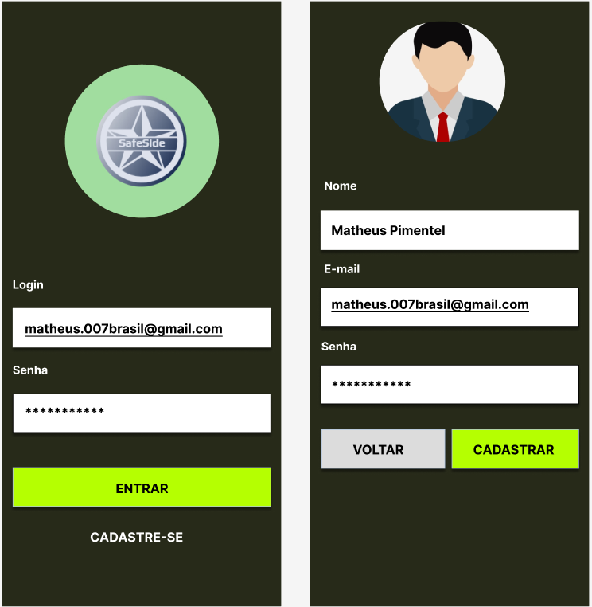
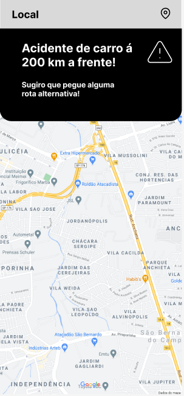
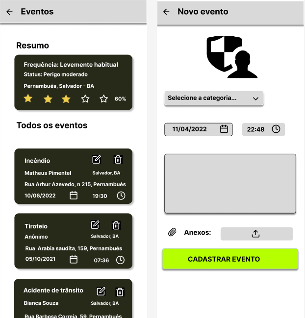
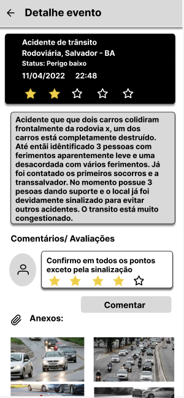

# SafeSide

Uma sistema para cadastrar eventos de acordo com  a localidade da geolocalização, através das coordenadas latitude e longitude o usuário ao ser vítima de um evento, poderá cadastrar a ocorrência para que outros usuários o vejam, possibilitando traçar novos trajetos e evitar riscos. O sistema documenta cada evento dando um resumo estatístico do mesmo.


## Licenças


[](https://choosealicense.com/licenses/mit/)


## 🔗 Links
[](https://veexi.com.br/)
[](https://www.linkedin.com/in/matheus-pimentel-santos/)


## Funcionalidades

- Cadastro de eventos
- Consulta o nível de risco de uma localidade
- Cadastro de usuários
- Resumo estatístico de eventos de um local

## Layout da Aplicação
   
## Instalação

Instale my-project com npm

```bash
  git clone https://github.com/Matheusp007-226/safe_side_frontend
  instalação node
  npm install 
  cd my-project
  npm start ou npx expo start
```
    
## Autores

- [@Matheusp007-226](https://www.github.com/Matheusp007-226)

- [@MarcosDev1982](https://www.github.com/MarcosDev1982)
